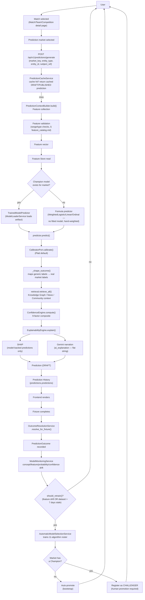

# TitanIQ — AI Intelligence Flow

**Status**: Live. Describes the real, current request-scoped path a single prediction takes —
synthesized directly from `modules/predictions/` code, cross-checked against
[`prediction_engine.md`](prediction_engine.md), [`calibration.md`](calibration.md), and
[`machine_learning.md`](machine_learning.md), which cover the same subsystems in more
implementation depth. This is the canonical *narrative* — one document that walks the whole
chain end to end, the way none of the per-subsystem docs individually do.

## The canonical flow

## Step-by-step, with real file paths

| Step | What happens | Where |
|---|---|---|
| **User → Match selected** | User is on a Match/Team/Competition detail page | `frontend/src/pages/sports/match-detail-page.tsx` etc. — see [`frontend_intelligence_architecture.md`](frontend_intelligence_architecture.md) |
| **Prediction market selected** | User picks a market (Match Winner, BTTS, ...) and clicks the generate action | Frontend calls `predictionsApi.generate()` |
| **Feature collection → validation → vector** | `PredictionContextBuilder.build()` assembles the feature vector for this market's required features | `modules/predictions/application/prediction_context_builder.py` |
| **Feature Store** | Features are read (not recomputed on the request path) | `modules/features/application/feature_store_service.py` |
| **Champion model / inference** | `_resolve_predictor()` prefers a fitted Champion (`TrainedModelPredictor` wrapping a `PredictionModelPort`) if `artifact_ref` exists; otherwise falls back to a formula predictor (`WeightedLogisticPredictor`/`WeightedLinearPredictor`/`WeightedOrdinalPredictor` — hand-weighted, no fitted model, not a Poisson-style baseline: **note that a prior version of this codebase did have Poisson baseline predictors; they were deliberately removed** — "one real trained model per market, never a fabricated placeholder" — see `decisions.md` ADRs around that consolidation) | `modules/predictions/application/prediction_engine.py::_resolve_predictor`, `infrastructure/predictors/` |
| **`predict_proba()` equivalent** | `predictor.predict()` returns a `PredictorOutput` (probability + raw feature contributions) | `ports/predictor.py`, `infrastructure/predictors/ml_predictor.py::TrainedModelPredictor.predict()` |
| **Probability calibration** | `CalibratorPort.calibrate()` — Platt Scaling by default, Isotonic/Temperature also implemented | `infrastructure/calibration/`, wired in `apps/api/composition.py::get_calibrator()` — see [`calibration.md`](calibration.md) |
| **SHAP** | Only for model-backed predictions — `ExplainabilityEngine.explain_with_shap()` calls `SHAPExplainerService` (`shap.TreeExplainer` for tree ensembles) | `application/explainability_engine.py`, `infrastructure/ml/shap_explainer_service.py` |
| **Gemini prompt / narration** | `ExplainabilityEngine.explain()` also produces `top_positive_features`/`top_negative_features`/`feature_importance` (ranked from real `feature_contributions`, not LLM-generated), then `GeminiAdapter.explain()` produces a single narrative string, `ai_explanation` | `modules/intelligence/infrastructure/gemini_adapter.py` |
| **Prediction (DRAFT)** | Assembled `Prediction` entity: `probability`, `confidence` (9-factor), `explanation` bundle, `feature_snapshot`, `probability_distribution`/`confidence_interval`/`expected_error` | `domain/entities.py::Prediction` |
| **Prediction History** | Persisted via `PredictionRepositoryPort`, table `predictions.predictions` | `infrastructure/persistence/repositories.py` |
| **Outcome Resolution** | When a fixture completes, `EntityReconciliationService` calls `OutcomeResolutionService.resolve_for_fixture()`, which resolves each open prediction against the market's `resolver_key` and writes a `PredictionOutcome` (`actual_value`, `error`, `evaluated_at`) | `modules/ingestion/application/entity_reconciliation_service.py`, `modules/predictions/application/outcome_resolution_service.py` |
| **Evaluation** | `ModelMonitoringService` computes four independent signals from `PredictionOutcome` history: concept drift (accuracy shift), feature drift (per-feature mean shift), probability drift, confidence drift | `application/model_monitoring_service.py`, `application/dataset_registry_service.py` |
| **Retraining** | `RetrainingScheduler.should_retrain()` triggers on **feature drift** or dataset staleness (>7 days) — not directly on concept drift, which is tracked/dashboarded but isn't itself the retrain trigger today | `application/training_pipeline_service.py::RetrainingScheduler` |
| **Champion Promotion** | `AutomaticModelSelectionService` trains an 11-algorithm roster, ranks by held-out metric, registers the winner. A market with no existing Champion auto-promotes (bootstrap); a market with a live Champion stops at CHALLENGER, pending a human `ModelRegistryService.promote_to_champion()` call | `application/model_selection_service.py`, `application/model_registry_service.py` |
| **Continuous Learning** | The loop repeats — the next prediction for this market is served by whichever model is now Champion | — |

## Honest gaps in this flow (documented, not glossed over)

- **`gemini_prompt_template`** is a real, stored field on `MarketDefinition` (settable via the Market Registry API) but is **never read**. `GeminiAdapter.explain()` uses its own hardcoded prompt string. This is dead data today, not a wired customization point — see [`gemini_intelligence_specification.md`](gemini_intelligence_specification.md).
- Gemini's real output is a **single flat narrative string**, not a structured breakdown into separate fields. See that same document for what today's output actually contains and what it doesn't.
- The Poisson-style statistical baseline (Dixon–Coles-equivalent) described in some external/aspirational specs **does not exist in this codebase** — the "no Champion yet" fallback is the hand-weighted formula predictors above, not a closed-form statistical model.

## What this document does not cover

Detailed calibration math → [`calibration.md`](calibration.md). Detailed model
selection/algorithm roster → [`machine_learning.md`](machine_learning.md) and
[`training_pipeline.md`](training_pipeline.md). Registry schemas → [`database_schema.md`](database_schema.md).
Per-page frontend consumption of this flow → [`frontend_intelligence_architecture.md`](frontend_intelligence_architecture.md).
The system-over-time view of this same loop (ingestion cadence, data aging) →
[`intelligence_lifecycle.md`](intelligence_lifecycle.md).
