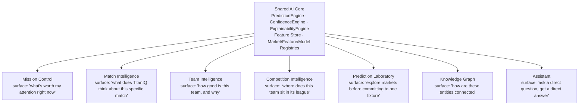

# TitanIQ — AI Product Architecture

**Status**: Live. A product-level (not technical) view of how AI actually surfaces to a user
across TitanIQ — which capability each surface exposes, and how they connect. Complements
[`frontend_intelligence_architecture.md`](frontend_intelligence_architecture.md) (the technical
per-page reference) with the "why does this page exist and what does it let someone do" framing.

## The throughline

Every surface below is a different lens onto the **same** backend intelligence
(`PredictionEngine`, `ConfidenceEngine`, `ExplainabilityEngine`, the Feature Store, the three
registries) — there is no surface with its own separate "AI." A prediction generated from Match
Intelligence and one generated from the Prediction Laboratory for the same fixture/market go
through the identical pipeline (§ [`ai_intelligence_flow.md`](ai_intelligence_flow.md)) and would
agree, because they're the same call.

## Per-surface product role

| Surface | User's job to be done | What AI capability it exposes | Honest status |
|---|---|---|---|
| **Mission Control** | "Show me what's worth my attention right now, across every sport I follow." | A curated, confidence-ranked feed (`predictionsApi.picks`) — the AI's own triage, not just a fixture list. | Real, full-depth. |
| **Match Intelligence** | "I'm looking at this specific match — what does TitanIQ think, and can I trust it?" | The primary place a prediction is generated and explained end-to-end: probability, confidence breakdown, SHAP/feature evidence, Gemini narration, related matches, Knowledge Graph context. | Real, full-depth — this is the flagship surface. |
| **Team Intelligence** | "How good is this team right now, and what's driving that read?" | A command-center view: strength/attack/defence/momentum scores (all real-derived, never fabricated composites), season analytics, AI quick insights, Team DNA (honestly split into measured axes and explicitly "not tracked yet" axes rather than guessed). | Real, full-depth — most recently redesigned card system for this specific page (this session). |
| **Competition Intelligence** | "Where does this team/match sit in the bigger picture of its league?" | Standings and fixtures in context. | Real but thin — no dedicated confidence/prediction surface of its own yet, leans on the entities within it (teams, matches) for AI depth. |
| **Prediction Laboratory** | "Let me explore markets and candidate predictions before committing to a specific fixture." | A market-exploration view across a sport, ahead of drilling into one match. | Real, but currently unlinked from primary navigation — reachable only by direct URL; a genuinely useful surface waiting on a deliberate IA decision about where it belongs in the main nav. |
| **Knowledge Graph** | "How is this entity connected to others TitanIQ tracks?" | Entity/relationship lookup — the same graph that quietly powers Match/Team Intelligence's "knowledge graph evidence" contribution to a prediction's explanation. | **Honest placeholder** — the standalone explorer page is text-based by its own admission, not yet a real visualization. The graph *data* is real and already contributes to predictions elsewhere; only this page's *presentation* of it is unfinished. |
| **Assistant ("TitanIQ Assistant")** | "Let me just ask, instead of navigating." | A turn-based conversational surface over the same real data — history lookups, entity comparisons, sentiment pulses, relationship queries. | Real, full-depth. |

## Where News Intelligence fits (deliberately not in the surface list above)

News Intelligence is real and full-depth, but is a **deliberate exception** to "every AI
capability gets its own primary-nav surface" — per `nav-config.ts`'s own documented rationale, it
surfaces *contextually* inside Match/Team/Competition/AI Picks/Assistant rather than existing as a
destination in its own right, on the reasoning that news is evidence *for* a prediction, not a
separate product a user navigates to on its own. The standalone page still exists and is directly
reachable — this is an information-architecture choice, not a missing feature.

## What makes this "one AI," not "seven AI features"

- **One confidence language everywhere**: the same 9-factor `ConfidenceBreakdown` and the same
  high/medium/low confidence-tone tokens render identically whether a prediction is surfaced on
  Mission Control's feed, Match Intelligence's detail view, or the Assistant's chat turn.
- **One explanation language everywhere**: SHAP for model-backed predictions, formula transparency
  for baseline predictions, Gemini narration layered on top of both — never a surface-specific
  "simplified" explanation that could disagree with the full one.
- **One evidence trail everywhere**: `feature_snapshot` on every persisted `Prediction` means any
  surface showing a prediction can, in principle, show exactly what fed it — the product promise
  ("TitanIQ predicts by showing its evidence" — `DESIGN_INFINITY.md`'s own direction thesis) is
  backed by a real, queryable audit trail, not just a UI convention.

## What this document does not cover

Technical per-page detail (API calls, React Query, components) →
[`frontend_intelligence_architecture.md`](frontend_intelligence_architecture.md). The request-scoped
technical pipeline → [`ai_intelligence_flow.md`](ai_intelligence_flow.md). The system-over-time
loop → [`intelligence_lifecycle.md`](intelligence_lifecycle.md). Visual design language →
[`design_system.md`](design_system.md) and [`DESIGN_INFINITY.md`](../DESIGN_INFINITY.md).
