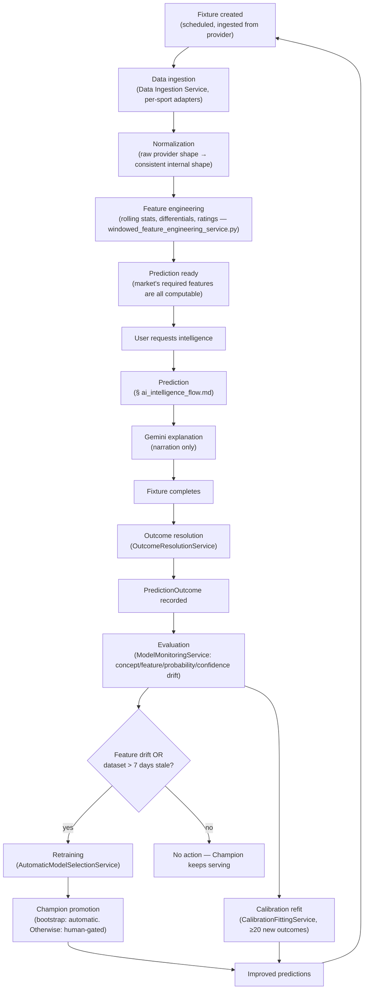

# TitanIQ — Intelligence Lifecycle

**Status**: Live. This is the **system-over-time** view of the same subsystems
[`ai_intelligence_flow.md`](ai_intelligence_flow.md) describes at request-scope — where that
document follows one prediction from click to display, this one follows a fixture and a model
across their full calendar lifetime, from first ingestion to the model improving because of it.

## The lifecycle

## Stages, and what "improved" actually means here

| Stage | Real mechanism | Honest note |
|---|---|---|
| Fixture created | Provider sync populates a scheduled fixture | Per-sport adapters, football has real live coverage; basketball/baseball providers are not yet registered — see [`prediction_markets.md`](prediction_markets.md) for current per-sport reality |
| Data ingestion | `Data Ingestion Service` | Raw provider data, untouched, per [`database_schema.md`](database_schema.md) |
| Normalization | Provider-shape → internal shape | Happens in the same ingestion pass, not a separate deferred job |
| Feature engineering | `windowed_feature_engineering_service.py` calculators (rolling stats, form differentials, expected-goals-style ratings) plus single-record calculators via `FeatureCalculatorPort` | See [`feature_catalog.md`](feature_catalog.md) for the full calculator inventory |
| Prediction ready | A market's `required_features` are all computable for this fixture | Enforced at market-definition level, not a separate "readiness" flag |
| User requests intelligence → Prediction → Gemini explanation | The full request-scoped chain | Fully detailed in [`ai_intelligence_flow.md`](ai_intelligence_flow.md) — not repeated here |
| Fixture completes | Provider sync reports final result | Triggers `EntityReconciliationService` |
| Outcome resolution | `OutcomeResolutionService.resolve_for_fixture()` resolves every open prediction against its market's `resolver_key` | **Historical note, resolved**: this write path had zero production call sites for a period (documented in the service's own docstring, dated 2026-08-02) — calibration/drift/dataset-building were all reading from a table nothing wrote to. Now wired via `entity_reconciliation_service.py`, plus a one-off backfill script (`backend/scripts/backfill_prediction_outcomes.py`) for fixtures that completed before the fix. Mentioned here because it's exactly the kind of lifecycle gap this document exists to make visible, not because it's still broken. |
| PredictionOutcome recorded | `predictions.prediction_outcomes` table | `actual_value`, `error`, `evaluated_at` — see [`database_schema.md`](database_schema.md) |
| Evaluation | `ModelMonitoringService` — **four independent signals**, not one collapsed "drift" concept: concept drift (accuracy shift between two `PredictionOutcome` windows), feature drift (per-feature mean shift between dataset versions), probability drift, confidence drift | `application/model_monitoring_service.py`, `application/dataset_registry_service.py` |
| Calibration | Refit on real `(probability, actual_outcome)` pairs, minimum 20 samples, independent of the retraining decision below | [`calibration.md`](calibration.md) |
| Retraining trigger | **Feature drift** or dataset staleness (>7 days) — concept drift is measured and dashboarded but is not itself the retrain trigger today | `RetrainingScheduler.should_retrain()`, `application/training_pipeline_service.py` |
| Retraining | `AutomaticModelSelectionService` — trains an 11-algorithm roster, ranks by held-out metric | [`training_pipeline.md`](training_pipeline.md) |
| Champion promotion | Bootstrap (no existing Champion): automatic. Otherwise: registers CHALLENGER, requires a human `ModelRegistryService.promote_to_champion()` call | [`model_registry.md`](model_registry.md) |
| Improved predictions | The next request for this market is served by whichever model is Champion *right now* — "improvement" is never assumed, only realized once a Challenger has actually out-scored the incumbent on held-out data and been explicitly promoted | — |

## Why this is a loop, not a pipeline

Every fixture that completes feeds the next model's training data; every model promotion changes
what the next prediction request sees. There is no terminal state — "improved predictions" isn't a
finish line, it's the reason the next fixture's outcome matters. The one thing that does **not**
loop: a model is never updated in place mid-lifecycle (no online learning, § `04-mlops-architecture.md`
in the separate aspirational spec set, if that document's framing is useful context — but this is
real behavior here too, not just aspirational). Each trip around the loop produces a fully new,
independently-evaluated model, never an incremental patch to the one currently serving.

## What this document does not cover

Per-request mechanics (calibration math, SHAP, Gemini's real prompt/output) →
[`ai_intelligence_flow.md`](ai_intelligence_flow.md). Feature calculator inventory →
[`feature_catalog.md`](feature_catalog.md). Training pipeline internals →
[`training_pipeline.md`](training_pipeline.md).
