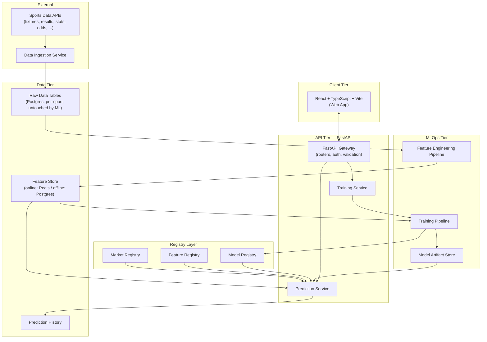
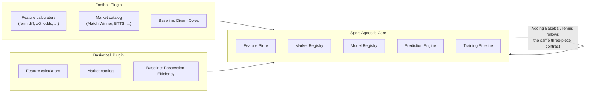

# 01 — System Architecture

> **Standalone spec artifact.** This document set (`docs/master-spec/`) is a from-scratch
> architecture specification written to a specific brief. It is **not** a description of what is
> currently deployed — for that, see [`docs/architecture.md`](../architecture.md) and the rest of
> the living `docs/` tree, which describe TitanIQ's actual, working implementation (a real Feature
> Store, Feature Registry, Market Registry, Model Registry with Champion/Challenger promotion, SHAP
> explainability, and calibrated probabilities are already running in this codebase today). Treat
> this set as a target-state reference / pitch-grade spec, expected to diverge from and partially
> duplicate the living docs by design — that tradeoff was made explicitly, not by accident.

## 1. Vision

TitanIQ is an enterprise-grade AI Sports Intelligence platform. It turns raw sports data — fixtures,
results, statistics, lineups, injuries, standings, odds — into **explainable, probability-calibrated
predictions** across Football, Basketball, Baseball, and Tennis, with a single shared AI
infrastructure that lets a new sport be added without modifying the core platform.

Every prediction the platform serves must be traceable back to: the features that produced it, the
model version that scored it, and — for every model-backed prediction — a SHAP explanation of which
features drove the outcome. A prediction with no evidence trail is a bug, not a shortcut.

## 2. High-Level Architecture



## 3. Guiding Principles

1. **Raw data is never model input.** Every raw table (fixtures, results, statistics, ...) is
   read-only from the ML system's perspective. All ML-facing values pass through the Feature
   Engineering Pipeline into the Feature Store first — see
   [`03-data-engineering-architecture.md`](03-data-engineering-architecture.md).
2. **Training and prediction are separate services.** A prediction request never triggers a
   `.fit()` call. Training runs on its own schedule/trigger, against its own dataset snapshot, and
   only *deploys* a new model — it never mutates a model that's currently serving traffic mid-flight.
3. **One shared AI infrastructure, N sport plugins.** The Feature Store, the three registries, the
   Training Pipeline, and the Prediction Pipeline are sport-agnostic. Each sport supplies: a set of
   feature calculators, a set of market definitions, and a baseline statistical model. Adding a
   fifth sport means adding those three things, not touching the core pipeline code.
4. **Every model-backed prediction is explainable.** No prediction ships without either a SHAP
   explanation (model-backed) or a transparent formula breakdown (baseline-backed). "Trust the
   model" is not an acceptable answer to "why."
5. **No fabricated confidence.** A market with insufficient historical data returns an explicit
   "insufficient data" response, never a guess dressed up as a probability.
6. **Explicit promotion, not silent replacement.** A newly trained model is a *Challenger* until it
   is deliberately promoted to *Champion* — see [`11-model-registry-schema.md`](11-model-registry-schema.md).
   The one exception is bootstrap: a market with no Champion at all promotes its first successful
   Challenger automatically, since there is nothing to regress against.

## 4. Sport Plugin Boundary



A sport plugin registers exactly three things against the core:

| Contract | What it provides | Registered via |
|---|---|---|
| Feature calculators | Sport-specific engineered features (e.g. Dixon-Coles-adjusted attack/defense strength for football, pace-adjusted efficiency for basketball) | Feature Registry (§ [09](09-feature-registry-schema.md)) |
| Market catalog | The list of predictable outcomes for that sport, with resolvers and required features | Market Registry (§ [10](10-market-registry-schema.md)) |
| Baseline statistical model | A closed-form, non-ML fallback that always produces a probability, even before enough data exists to train an ML model | Prediction Pipeline (§ [13](13-prediction-pipeline.md)) |

The core never imports sport-specific code. It discovers registered markets/features/baselines
through the registries at runtime.

## 5. Data Flow (Narrative)

```
Sports Data APIs
      │
      ▼
Data Ingestion Service        (per-sport adapters, one contract: fetch → normalize → persist)
      │
      ▼
Raw Data Tables                (Postgres; append-only from the ML system's point of view)
      │
      ▼
Feature Engineering Pipeline   (cleaning, rolling stats, EWM, ratings, leakage guards — see 03)
      │
      ▼
Feature Store                  (online + offline; the only thing Prediction/Training ever read)
      │              │
      ▼              ▼
Prediction Service   Training Service
      │              │
      ▼              ▼
  Frontend        Model Registry → (promoted) → back into Prediction Service
```

## 6. Component Inventory

| Component | Responsibility | Primary tech |
|---|---|---|
| Data Ingestion Service | Pull from sports data APIs, normalize, write raw tables | FastAPI background workers / Celery tasks |
| Raw Data Tables | Immutable-from-ML system of record for provider data | PostgreSQL |
| Feature Engineering Pipeline | Turn raw rows into ML-ready, versioned features | Python, pandas, reusable by both services |
| Feature Store | Serve engineered features to both prediction and training | PostgreSQL (offline) + Redis (online cache) |
| Feature Registry | Catalog of every feature's name, formula, source, version | PostgreSQL |
| Market Registry | Catalog of every predictable outcome per sport | PostgreSQL |
| Model Registry | Catalog of every trained model, its lineage, and its deployment status | PostgreSQL + object storage for artifacts |
| Prediction Service | Serve a single prediction end-to-end, with explanation | FastAPI + LightGBM/CatBoost/XGBoost (loaded, not trained) |
| Training Service | Build datasets, fit candidate models, evaluate, register | Python, LightGBM/CatBoost/XGBoost, SHAP |
| Confidence Engine | Aggregate multiple reliability signals into one composite confidence score | Python |
| Explainability Engine | Produce SHAP-based local/global feature attributions | Python, `shap` |
| Frontend | Present predictions, evidence, and confidence to the user | React, TypeScript, Vite |

## 7. Where the rest of this spec lives

- ML-specific architecture (algorithms, frameworks, explainability, calibration):
  [`02-ml-architecture.md`](02-ml-architecture.md)
- Feature engineering responsibilities in depth: [`03-data-engineering-architecture.md`](03-data-engineering-architecture.md)
- MLOps lifecycle (train → evaluate → promote → retrain): [`04-mlops-architecture.md`](04-mlops-architecture.md)
- Backend folder structure, schemas, registries, pipelines, API contracts, and operational
  strategy: Milestones 2–6, listed once written in `docs/master-spec/index.md`.
