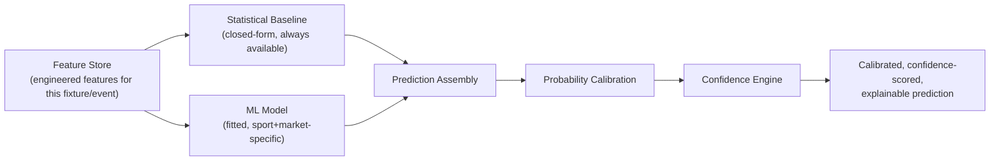

# 02 — ML Architecture

> Part of the standalone `docs/master-spec/` set — see the notice at the top of
> [`01-system-architecture.md`](01-system-architecture.md). This document specifies the ML layer:
> algorithms per sport, the model interface contract, explainability, and calibration.

## 1. Two-Tier Prediction Strategy

Every market is served by two cooperating layers, never one alone:



- **Statistical Baseline**: a closed-form model (Dixon–Coles, possession-efficiency, run-expectancy,
  Elo/Glicko — one per sport, §3) that always produces a probability, including for markets with too
  little history to train an ML model. It is the honest fallback, not a placeholder — it's a real,
  well-understood statistical model in its own right.
- **ML Model**: a fitted, sport-and-market-specific model (LightGBM primary, CatBoost/XGBoost as
  benchmarks) trained on engineered features, including the baseline's own output as one input
  feature where useful (a *residual* model — see §3, Football).
- Once an ML model exists and is promoted to Champion for a market, the Prediction Service prefers
  it; the baseline stays as the served output only for markets that have no Champion yet
  (bootstrapping) or as a documented fallback if model loading fails.

## 2. `PredictionModel` Interface — the framework-independence seam

Every framework adapter (LightGBM, CatBoost, XGBoost, and PyTorch when it lands) implements one
interface, so the Prediction/Training Services never depend on a specific ML library directly:

```python
class PredictionModel(Protocol):
    target_type: TargetType              # CLASSIFICATION | REGRESSION
    feature_order: list[str]             # canonical feature vector ordering

    async def fit(
        self,
        samples: list[TrainingSample],
        validation_samples: list[TrainingSample] | None = None,
    ) -> TrainingMetrics: ...

    def predict_one(self, features: dict[str, float]) -> ModelPrediction: ...
    def feature_importance(self) -> dict[str, float]: ...
    def is_fitted(self) -> bool: ...
    def underlying_estimator(self) -> object: ...   # raw fitted object, for SHAP
    def serialize(self) -> bytes: ...
    def deserialize(self, payload: bytes) -> None: ...
```

`fit()` refuses (raises `InsufficientTrainingDataError`) below a minimum sample threshold (30
samples) rather than fitting on too little data and calling it a model. `validation_samples`, when
supplied, enables native early stopping on the gradient-boosting adapters.

## 3. Frameworks & Algorithms

| Framework | Role | Sports using it |
|---|---|---|
| LightGBM | Primary ML algorithm — fast, handles categorical features natively, strong default choice for tabular sports data | Football, Basketball, Tennis (all markets); Baseball (benchmarked against CatBoost) |
| CatBoost | Benchmark algorithm; primary for Baseball given its native handling of the sparse, highly-categorical pitcher/batter matchup features | Baseball (primary), benchmarked on all sports |
| XGBoost | Benchmark algorithm, included in every sport's Automatic Model Selection roster for comparison | All sports (benchmark) |
| PyTorch | Reserved for future sequence/embedding-based models (e.g. player-embedding-driven matchup models) — not part of the initial market-by-market rollout | None yet |
| scikit-learn | Baseline classical estimators (logistic/linear regression, random forest) included in the Automatic Model Selection roster as a sanity floor against the gradient-boosting family | All sports (benchmark) |

**Algorithm selection is automatic, not hand-picked per market.** For every market, Training builds
a roster of candidate algorithms (LightGBM, XGBoost, CatBoost, plus classical scikit-learn
estimators), trains all of them against the same dataset split, ranks by the held-out test metric
(accuracy for classification markets, MAE for regression markets), and registers the winner as a
Challenger. See [`12-training-pipeline.md`](12-training-pipeline.md).

## 4. Per-Sport Prediction Engines

| Sport | Baseline | ML |
|---|---|---|
| Football | Dixon–Coles Adjusted Poisson | LightGBM Residual Model |
| Basketball | Possession Efficiency Model | LightGBM |
| Baseball | Run Expectancy Model | CatBoost (benchmarked against LightGBM) |
| Tennis | Elo/Glicko Rating System | LightGBM |

Full market lists per sport are specified in
[`16-sport-prediction-engines.md`](16-sport-prediction-engines.md) (Milestone 5).

**Football's "Residual Model" pattern** (representative of how a sport pairs its baseline and ML
layer): the Dixon–Coles baseline produces an expected-goals-based probability first; the ML model is
trained not to predict the outcome from scratch, but to predict the *residual* between the
baseline's probability and reality, using additional engineered features (recent form differential,
market odds movement, injury-adjusted lineup strength) the closed-form baseline can't incorporate.
The final served probability is the baseline adjusted by the learned residual. This keeps the model
honest about what it's actually adding over a well-understood statistical prior, and keeps
predictions stable even when the ML model's training data is thin.

## 5. Ensembling

Three ensemble strategies are available at the Training Service level for markets where multiple
candidate models perform comparably and combining them measurably improves the held-out metric:

- **Voting Ensemble** — simple average (classification: probability average; regression: value
  average) across a fixed set of fitted models.
- **Stacked Ensemble** — a lightweight meta-learner (logistic/linear regression) trained on the
  out-of-fold predictions of the base models.
- **Dynamic Ensemble** — per-prediction weighting based on which base model has historically
  performed best in the *current* feature-similarity neighborhood (e.g. weight the model that's
  historically stronger for this specific team's data density).

An ensemble is only registered as a Challenger if it beats every one of its constituent models on
the held-out metric — an ensemble that merely matches its best member is not worth the extra
inference cost and is discarded.

## 6. Explainability

Every model-backed prediction carries a SHAP explanation:

- `shap.TreeExplainer` for tree-ensemble models (LightGBM, XGBoost, CatBoost) — exact, fast.
- `shap.KernelExplainer` as the model-agnostic fallback for any adapter that isn't a tree ensemble
  (e.g. a future PyTorch model).

The explanation bundle includes: local SHAP values for this specific prediction, global feature
importance for the model as a whole, the SHAP base value, feature-interaction values, and a decision
path. Two derived views are always available: `top_positive_features` / `top_negative_features`
(the features that pushed the prediction toward vs. away from the predicted outcome) and a
counterfactual query ("what would need to change for the prediction to flip").

Baseline (non-ML) predictions carry an equivalent but formula-based breakdown instead of SHAP — the
statistical baseline's inputs and weights are transparent by construction, so "explainability" there
means surfacing the formula terms, not approximating them.

A narrative explanation (plain-language summary of the SHAP output) may be generated by an LLM for
display purposes, but the LLM never influences the probability itself — it narrates a result that
was already computed, and is clearly distinguishable in the response from the scoring path.

## 7. Confidence Engine

The probability alone is not the whole answer — a well-calibrated 62% from a model trained on 400
matches and fresh data is a different claim than the same 62% from a model trained on 25 matches
with stale features. The Confidence Engine aggregates a composite confidence score from multiple
independent signals:

| Factor | What it measures |
|---|---|
| Feature quality | Completeness/validity of the features actually used for this prediction |
| Feature freshness | How recent the underlying data is relative to the event |
| Historical accuracy | The serving model's track record on this specific market |
| Data completeness | Fraction of the ideal feature set that was actually available |
| Model reliability | Held-out evaluation metrics of the serving model |
| Prediction stability | Sensitivity of the output to small input perturbations |
| Knowledge graph completeness | Depth of contextual relationship data available for the entities involved |
| News signal reliability | Confidence of any news-derived sentiment/event features used |
| Community signal reliability | Confidence of any community/crowd signal features used |

The composite is a documented aggregation (not a black box) so a low-confidence prediction can be
traced back to *which* factor dragged it down.

## 8. Probability Calibration

Raw model output is a score, not necessarily a calibrated probability — a model that says "70%"
should be right about 70% of the time across all its 70% predictions, and gradient-boosted trees in
particular are known to produce overconfident scores without calibration.

Three calibration methods are supported, selected per market based on how much labeled history
exists:

- **Platt Scaling** (logistic/sigmoid) — the default; works well with moderate sample sizes and is
  cheap to refit.
- **Isotonic Regression** — non-parametric, more flexible, preferred once a market has enough
  labeled outcomes (100+) that overfitting risk is low.
- **Temperature Scaling** — a single-parameter softmax adjustment, useful for multi-class markets
  (e.g. three-way Match Winner) where Platt/Isotonic's binary framing doesn't apply directly.

Calibration is fit on real `(predicted_probability, actual_outcome)` pairs collected from a market's
Champion model's prediction history (minimum 20 samples before a fit is attempted), and is refit on
its own schedule as more outcomes accumulate — never fit on the same batch it's about to calibrate
for a live request (see [`04-mlops-architecture.md`](04-mlops-architecture.md) §3).
