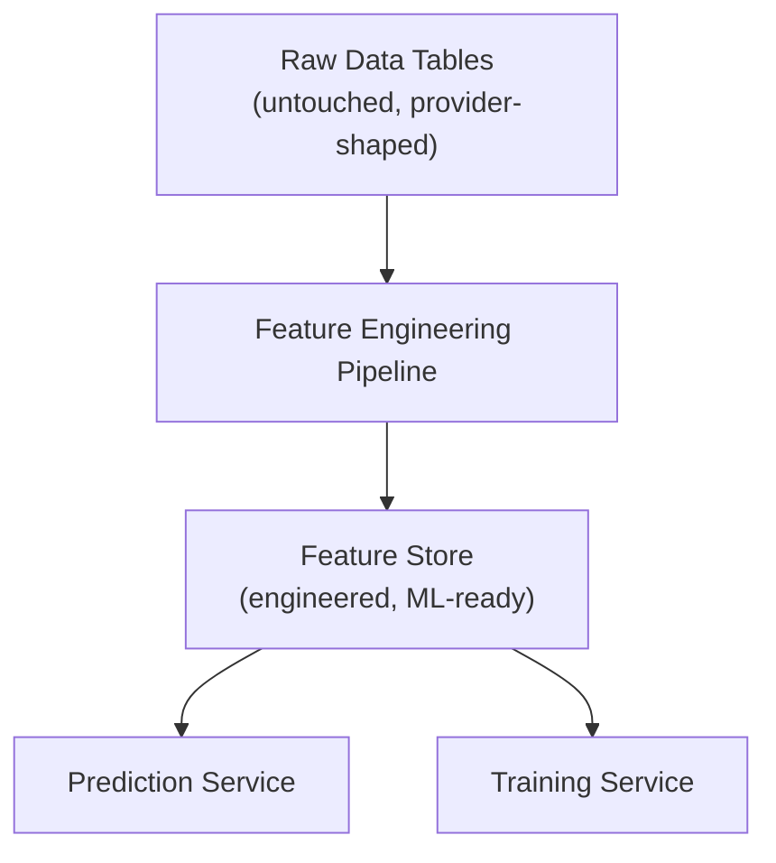

# 03 — Data Engineering Architecture

> Part of the standalone `docs/master-spec/` set — see the notice at the top of
> [`01-system-architecture.md`](01-system-architecture.md). This document specifies the Feature
> Engineering Pipeline: the one path every raw value must travel through before it can reach a model.

## 1. Position in the Data Flow



Raw tables are the immutable system of record for what a provider actually sent. The Feature
Engineering Pipeline is the *only* code path allowed to read raw tables for ML purposes, and its
only allowed output is writes to the Feature Store. Neither the Prediction Service nor the Training
Service ever queries a raw table directly — this is what makes both services swappable/scalable
independently of ingestion, and what makes "raw tables remain untouched" an enforceable invariant
rather than a convention.

## 2. Pipeline Responsibilities

The pipeline runs as a sequence of named stages, each independently testable and independently
reusable by both the Prediction Service (single-record, on-demand) and the Training Service
(bulk, dataset-scale):

```mermaid
flowchart LR
    A["Read raw"] --> B["Clean"]
    B --> C["Handle missing values"]
    C --> D["Normalize"]
    D --> E["Rolling stats /\nmoving averages / EWM"]
    E --> F["Interaction features"]
    F --> G["Sport-specific ratings"]
    G --> H["Outlier detection"]
    H --> I["Leakage guard"]
    I --> J["Historical snapshot"]
    J --> K["Write to Feature Store"]
```



| Stage | Responsibility |
|---|---|
| Read raw | Pull the relevant raw rows for the entity/window being featurized (a fixture, a team's trailing N matches, a player's season). |
| Clean | Coerce provider-inconsistent types/units, drop or flag structurally invalid rows (e.g. a fixture with no recorded score after full-time). |
| Handle missing values | Explicit policy per feature: impute with a documented default, carry forward the last known value, or — when no honest default exists — return `null` and let the consuming feature stay unset rather than fabricate a value. |
| Normalize | Scale values onto comparable ranges where the downstream model benefits (e.g. per-90-minutes normalization for football stats so a feature isn't dominated by minutes played). |
| Rolling stats / moving averages | Trailing-window aggregates (last 5/10 games form, rolling shots-on-target average) — the core of "form" as a feature family. |
| Exponentially weighted features | EWM variants of the above, so recent matches count more than older ones within the same window without a hard cutoff. |
| Interaction features | Cross-products of otherwise-independent features where domain knowledge says the *combination* matters (e.g. home-advantage × opponent-away-record, not just each alone). |
| Sport-specific ratings | Elo/Glicko-style or possession-efficiency-style derived ratings that summarize a team/player's strength as a single number, updated incrementally as results come in. |
| Outlier detection | Flag statistically extreme values (e.g. a 9-goal match, a season-ending injury week) so downstream training can choose to downweight or exclude them explicitly, rather than let them silently dominate a small dataset. |
| Leakage prevention | The hard invariant: no feature computed for a training sample may use information that would not have been available *before* that sample's real-world kickoff/tip-off time. Every windowed calculator takes an explicit `as_of` timestamp and filters strictly to data before it. |
| Historical snapshots | Every computed feature value is versioned and timestamped, not overwritten in place — so a model trained in the past can be re-evaluated against the exact feature values it actually saw, and drift can be measured feature-by-feature over time. |
| ML-ready dataset production | The pipeline's terminal output for the Training Service: a versioned, labeled dataset (§ [12](12-training-pipeline.md)) assembled from Feature Store reads, not from a fresh raw-table scan. |

## 3. Reusability Contract

Both the Prediction Service and the Training Service consume the pipeline through the same
interface — the difference is only *when* and *how many* records flow through it:

```python
class FeatureCalculator(Protocol):
    feature_key: str
    sport_code: str

    async def compute(self, entity_ref: EntityRef, as_of: datetime) -> float | None:
        """Compute one feature value as of a point in time. Must not read data
        that would not have existed before `as_of` in the real world."""
        ...
```

- **Prediction Service**: calls `compute()` for exactly the feature set a market's required-features
  list demands, for a single upcoming fixture, `as_of = now()`.
- **Training Service**: calls `compute()` (or a bulk-optimized equivalent that shares the same
  leakage-prevention logic) for every historical fixture in the training window, `as_of =` that
  fixture's actual kickoff time — never `now()`.

Because both paths go through the same calculator implementations, a feature can never silently
diverge between what a model was trained on and what it's served at prediction time.

## 4. Data Quality Gates

Before a computed feature is written to the Feature Store, it passes a validation gate:

- **Type/range validation** against the feature's registered `expected_range` (§
  [09-feature-registry-schema.md](09-feature-registry-schema.md)).
- **Null-rate monitoring** — a feature whose null rate spikes for a given sport/window is flagged,
  not silently accepted, since it usually signals an upstream provider outage rather than a genuine
  absence of data.
- **Leakage assertion** in test environments — calculators are unit-tested with a fixture set that
  includes future data outside the `as_of` window, asserting the calculator never touches it.

## 5. What This Document Does Not Cover

Feature Store table schema and read/write API → [`08-feature-store-schema.md`](08-feature-store-schema.md).
Feature Registry (the catalog of what each feature *means*) → [`09-feature-registry-schema.md`](09-feature-registry-schema.md).
Raw table schema per sport → [`07-raw-data-schema.md`](07-raw-data-schema.md).
