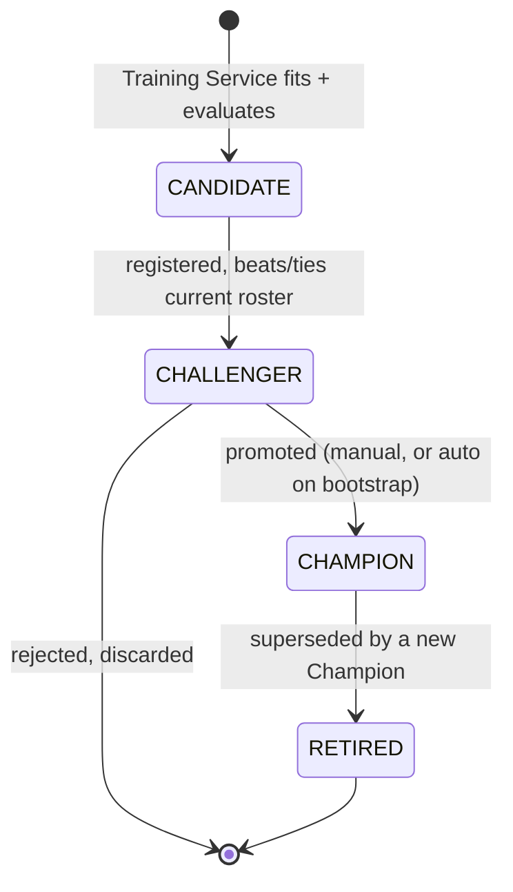
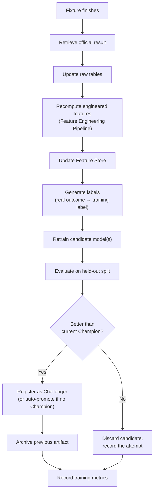

# 04 — MLOps Architecture

> Part of the standalone `docs/master-spec/` set — see the notice at the top of
> [`01-system-architecture.md`](01-system-architecture.md). This document specifies the operational
> lifecycle a model moves through, from first training run to retirement.

## 1. Model Lifecycle

- **CANDIDATE**: the immediate output of a training run — fitted, evaluated against a held-out
  split, not yet compared against anything currently live.
- **CHALLENGER**: a candidate that has been registered in the Model Registry as the current
  best-in-roster for its market. A market can have at most one active Challenger at a time.
- **CHAMPION**: the model actually serving live predictions for its market. Promotion
  Challenger → Champion is a deliberate act (§3), except for the bootstrap case.
- **RETIRED**: a former Champion, kept for audit/rollback, no longer serving traffic.

A market carries **at most one Champion and at most one Challenger** at any time — this is an
invariant enforced by the Model Registry (§ [11](11-model-registry-schema.md)), not a convention
callers are trusted to respect.

## 2. Training Never Runs Inside a Prediction Request

This is the single hardest boundary in the system: the Prediction Service's request path may only
*read* — Feature Store, registries, a pre-loaded model artifact. It never calls `.fit()`, never
writes to the Model Registry, and never blocks on a training job. Training is triggered
independently (§4) and communicates with the serving path only by writing a new Model Registry row
and (on promotion) updating which artifact the Prediction Service loads for a market.

Models are kept warm — loaded into process memory or a fast local cache — so a prediction request
never pays a cold-load cost against durable storage on the hot path.

## 3. Champion/Challenger Promotion Policy

| Situation | Behavior |
|---|---|
| Market has no Champion yet (bootstrap) | The first Challenger that passes evaluation is **automatically promoted** to Champion — there is nothing to regress against, and refusing to serve a validated model just because no prior exists would be worse than serving it. |
| Market already has a Champion | A new Challenger **stops at CHALLENGER**. Promotion to Champion requires an explicit approval action (§ [15-api-contracts.md](15-api-contracts.md) `POST /models/{id}/promote`), comparing the Challenger's held-out metrics against the current Champion's. |
| A promotion happens | The prior Champion is atomically moved to RETIRED in the same transaction — a market is never left with two simultaneous Champions. |
| Rollback is needed | A RETIRED model can be re-promoted directly back to CHAMPION (§ [11](11-model-registry-schema.md) `POST /models/{id}/rollback`), which retires whatever is currently CHAMPION. |

## 4. Automatic Retraining

Retraining is **rolling-window**, not online learning: a fresh model is periodically refit on the
current trailing window of labeled data (e.g. the last N seasons/matches), rather than incrementally
updated match-by-match. Online/incremental learning is explicitly out of scope — it makes evaluation
and rollback far harder to reason about, and this platform's evidence/explainability requirements
depend on being able to point at *one* fixed model version that produced a given prediction.

**Retraining triggers** (either is sufficient to schedule a training run for a market):
- **Drift detected**: the market's recent live-prediction accuracy has degraded past a documented
  threshold relative to its own held-out evaluation metric at training time.
- **Dataset staleness**: the market's current Champion was trained on a dataset snapshot older than
  a fixed freshness window (e.g. 7 days), regardless of drift — so a market never quietly runs
  forever on a widening blind spot even if nothing has obviously broken.

## 5. Calibration's Place in the Lifecycle

Calibration (§ [02-ml-architecture.md](02-ml-architecture.md) §8) is fit **after** a model is
serving as Champion, using real `(predicted_probability, actual_outcome)` pairs accumulated from
that Champion's own prediction history — never fit during the same training run that produced the
model, and never fit on data the model was trained on. This keeps calibration honestly measuring
"how well-calibrated is this model in live use," not "how well-calibrated does it look on its own
training set."

Calibration refits on its own schedule (minimum 20 new outcome samples since the last fit) and is
versioned independently of the model artifact it calibrates — a model's artifact does not change
when its calibration curve is refit.

## 6. Deployment Modes

A promoted Champion can serve traffic in one of three modes, recorded on its Model Registry row:

| Mode | Behavior |
|---|---|
| `shadow` | Runs alongside the current serving path and its predictions are logged, but never returned to a user — used to validate a new model's real-world behavior before it's trusted with live traffic. |
| `canary` | Serves a small, explicit percentage of live traffic for a market, with the remainder still served by the previous Champion, so a regression is caught on limited exposure. |
| `live` | Serves 100% of traffic for its market — the normal steady state for a Champion. |

## 7. What This Document Does Not Cover

Detailed training pipeline stages → [`12-training-pipeline.md`](12-training-pipeline.md). Detailed
prediction request pipeline → [`13-prediction-pipeline.md`](13-prediction-pipeline.md). Model
Registry schema/fields → [`11-model-registry-schema.md`](11-model-registry-schema.md). Deployment
infrastructure (containers, scaling, rollout mechanics) → [`17-deployment-strategy.md`](17-deployment-strategy.md).
