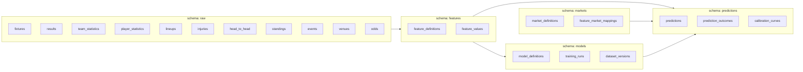

# 06 — PostgreSQL Schema

> Part of the standalone `docs/master-spec/` set — see the notice at the top of
> [`01-system-architecture.md`](01-system-architecture.md). This document specifies the
> database-wide conventions every table in this spec follows. Table-by-table DDL lives in the
> documents it links to below.

## 1. Target Database

PostgreSQL, accessed via SQLAlchemy 2.0 in async mode (`asyncpg` driver), migrated with Alembic as
one linear history. Every DDL statement in this spec is written to be dialect-portable where
reasonably possible (no Postgres-only syntax used gratuitously), so the same models can run against
a local SQLite instance for fast unit tests without a second schema to maintain — this mirrors a
pattern already proven out in this codebase.

## 2. Schema-per-Domain

Rather than one flat `public` schema, tables are grouped into a Postgres schema per bounded
context, matching the module boundaries in [`05-fastapi-folder-structure.md`](05-fastapi-folder-structure.md):

Each schema is owned by exactly one module's `infrastructure/persistence/` layer — no module writes
into another schema's tables directly; cross-schema reads happen through the owning module's
repository/service, never a raw join issued by a different module.

## 3. Cross-Cutting Column Conventions

Every table in every schema carries this baseline, unless explicitly noted otherwise:

| Column | Type | Notes |
|---|---|---|
| `id` | `uuid` | Primary key, generated application-side (`uuid4`), never a bare serial — keeps IDs safe to reference across services/logs without leaking row counts. |
| `created_at` | `timestamptz` | Set once, server-side default `now()`. |
| `updated_at` | `timestamptz` | Updated on every write (application-level, not a trigger, to keep behavior visible in code). |
| `sport_code` | `text` | Present on every table whose data is sport-specific (`'football' \| 'basketball' \| 'baseball' \| 'tennis'`); absent only on genuinely sport-agnostic tables (e.g. `identity.users`). |

## 4. Naming Conventions

- Table names: `snake_case`, plural (`fixtures`, not `fixture`).
- Foreign key columns: `<referenced_table_singular>_id` (`fixture_id`, `team_id`).
- Enum-like status columns are backed by a Postgres `CHECK` constraint against a fixed value set
  defined in the owning domain module, not a native Postgres `ENUM` type — this keeps adding a new
  status value a plain migration rather than a type-alteration migration.
- Every foreign key is indexed explicitly; Postgres does not do this automatically.

## 5. Row-Level Security

Every schema whose tables are ever queried on behalf of an end user (not just internal
services) enables RLS, with policies scoped by tenant/organization for multi-tenant tables and by
role for admin-only tables. RLS is enforced at the database layer as the source of truth — the
application layer's own authorization checks are a defense-in-depth measure, never the only gate.

## 6. Migrations

Alembic, one linear history under `alembic/versions/`. Every migration is reviewed like code; no
manual schema edits in any environment, including local development — the local database is always
brought up to date by running migrations, never by hand-editing tables to match code.

## 7. Where Each Schema Is Defined in Detail

| Schema | Detailed in |
|---|---|
| `raw` | [`07-raw-data-schema.md`](07-raw-data-schema.md) |
| `features` | [`08-feature-store-schema.md`](08-feature-store-schema.md) and [`09-feature-registry-schema.md`](09-feature-registry-schema.md) |
| `markets` | [`10-market-registry-schema.md`](10-market-registry-schema.md) |
| `models` | [`11-model-registry-schema.md`](11-model-registry-schema.md) |
| `predictions` | [`13-prediction-pipeline.md`](13-prediction-pipeline.md) §5 (Prediction History) |
