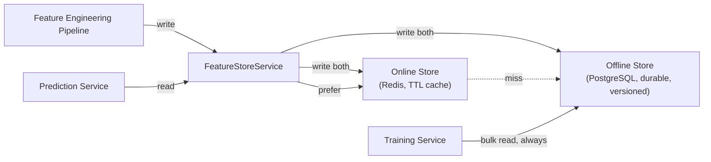

# 08 — Feature Store Schema

> Part of the standalone `docs/master-spec/` set — see the notice at the top of
> [`01-system-architecture.md`](01-system-architecture.md). This document specifies where computed
> features live and how they're read/written. The catalog of what each feature *means* is a
> separate concern — see [`09-feature-registry-schema.md`](09-feature-registry-schema.md).

## 1. Dual-Backed Design



- **Offline store (PostgreSQL)**: the durable, versioned system of record for every feature value
  ever computed. Training always reads here — it needs the full historical, point-in-time-correct
  series, not just the latest value.
- **Online store (Redis)**: a TTL-bounded cache of the *latest* value per `(feature_key, entity_id)`,
  optimized for the Prediction Service's low-latency read path. A miss falls back to the offline
  store and repopulates the cache.
- Every write goes to both stores in the same call — the online store is never the sole owner of a
  value that doesn't also exist offline.

## 2. Offline Table

```sql
CREATE SCHEMA IF NOT EXISTS features;

CREATE TABLE features.feature_values (
    id              uuid PRIMARY KEY,
    feature_key     text NOT NULL REFERENCES features.feature_definitions(feature_key),
    entity_type     text NOT NULL,          -- 'team' | 'player' | 'fixture' | 'matchup'
    entity_id       uuid NOT NULL,
    sport_code      text NOT NULL,
    as_of           timestamptz NOT NULL,   -- the point in time this value is valid for
    value_numeric   double precision,        -- scalar features
    value_json      jsonb,                   -- vector/structured features (rare; scalar is the default)
    feature_version integer NOT NULL,        -- bumped when the calculation method changes (§09 §3)
    computed_at     timestamptz NOT NULL DEFAULT now(),
    source          text NOT NULL,           -- calculator/service that produced this value
    UNIQUE (feature_key, entity_type, entity_id, as_of, feature_version)
);
CREATE INDEX ix_feature_values_lookup
    ON features.feature_values (feature_key, entity_type, entity_id, as_of DESC);
```

Values are **append-only**: a recomputation for the same `(feature_key, entity_id, as_of)` under a
new `feature_version` is a new row, never an update to the old one. This is what makes "re-evaluate
a model against exactly the feature values it was trained on" possible — the historical snapshot
requirement from [`03-data-engineering-architecture.md`](03-data-engineering-architecture.md) §2 is
enforced at the schema level, not just by convention.

## 3. Online Cache Key Scheme

```
key:    fs:{sport_code}:{feature_key}:{entity_type}:{entity_id}
value:  { "value": <number|object>, "as_of": "<iso8601>", "feature_version": <int> }
ttl:    features.feature_definitions.online_ttl_seconds  (per-feature, not global)
```

TTL is set per feature at registration time (§ [09](09-feature-registry-schema.md)) — a
slow-changing feature (a season-long rating) can cache for hours; a fast-changing one (live odds
movement) for seconds.

## 4. Read API

```python
class FeatureStoreService(Protocol):
    async def write(self, values: list[FeatureValue]) -> None:
        """Writes to offline store first (durability), then online cache."""

    async def read_latest(
        self, feature_keys: list[str], entity_type: str, entity_id: UUID,
    ) -> dict[str, FeatureValue | None]:
        """Online-first read for the Prediction Service's hot path."""

    async def read_as_of(
        self, feature_keys: list[str], entity_type: str, entity_id: UUID, as_of: datetime,
    ) -> dict[str, FeatureValue | None]:
        """Offline-only, point-in-time-correct read for Training. Never touches the cache."""

    async def read_bulk_as_of(
        self, feature_keys: list[str], entity_refs: list[tuple[str, UUID]], as_of: datetime,
    ) -> list[dict[str, FeatureValue | None]]:
        """Batch variant of read_as_of for dataset construction (§ 12-training-pipeline.md)."""
```

## 5. Feature Categories Supported

| Category | Meaning | Example |
|---|---|---|
| Historical | A value computed once for a fixed point in the past, never recomputed | Final-season rating at the end of last season |
| Real-time | Computed as close to prediction time as possible, short/no TTL | Latest odds movement before kickoff |
| Cached | Expensive to compute, safe to serve slightly stale within a TTL window | Rolling 10-game form (recomputed hourly, not per-request) |
| Rolling | A trailing-window aggregate, recomputed as the window slides | Last-5-games goals-for average |
| Derived | Computed from other features already in the store, not directly from raw data | A composite "attack strength" rating built from several rolling stats |

All five share the same table and read/write API — "category" is a registry-level classification
(§ [09](09-feature-registry-schema.md)) that informs TTL/refresh policy, not a schema difference.

## 6. What This Document Does Not Cover

Feature definitions, ownership, and lifecycle → [`09-feature-registry-schema.md`](09-feature-registry-schema.md).
How raw data becomes a feature value in the first place → [`03-data-engineering-architecture.md`](03-data-engineering-architecture.md).
