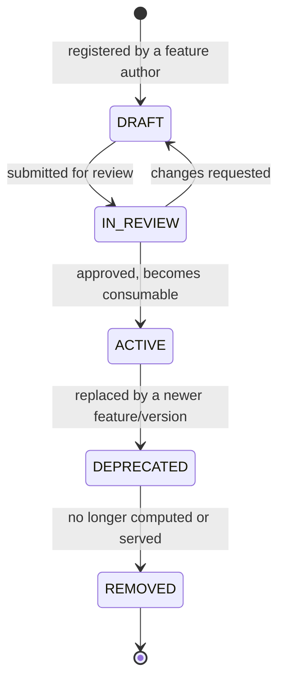

# 09 — Feature Registry Schema

> Part of the standalone `docs/master-spec/` set — see the notice at the top of
> [`01-system-architecture.md`](01-system-architecture.md). This document specifies the catalog of
> what each feature *means* — as distinct from [`08-feature-store-schema.md`](08-feature-store-schema.md),
> which specifies where its *values* live.

## 1. Purpose

A feature value with no registry entry is unusable, no matter how correctly it was computed: nobody
downstream can tell what it means, whether it's still trustworthy, or whether it's safe to feed to a
new model. The registry is the single place that answers "what is this feature, and can I use it."

## 2. Table

```sql
CREATE TABLE features.feature_definitions (
    feature_key         text PRIMARY KEY,        -- e.g. 'football.team.form_diff_last5'
    name                 text NOT NULL,
    description           text NOT NULL,
    sport_code            text NOT NULL,
    category               text NOT NULL,          -- historical | real_time | cached | rolling | derived
    entity_type            text NOT NULL,           -- 'team' | 'player' | 'fixture' | 'matchup'
    data_type               text NOT NULL,           -- 'float' | 'int' | 'bool' | 'categorical' | 'vector'
    formula                  text NOT NULL,           -- human-readable calculation description
    source_tables            text[] NOT NULL,          -- raw.* / features.* tables this depends on
    dependencies              text[] NOT NULL DEFAULT '{}',  -- other feature_keys this derives from
    expected_range             numrange,                -- validation gate, § 03 §4
    update_frequency            text NOT NULL,            -- 'per_fixture' | 'daily' | 'hourly' | 'on_demand'
    online_ttl_seconds           integer NOT NULL DEFAULT 3600,
    owner                          text NOT NULL,           -- team/individual accountable for this feature
    version                        integer NOT NULL DEFAULT 1,
    status                          text NOT NULL DEFAULT 'draft',  -- § 3 lifecycle
    created_at                       timestamptz NOT NULL DEFAULT now(),
    updated_at                        timestamptz NOT NULL DEFAULT now()
);
CREATE INDEX ix_feature_definitions_sport_status
    ON features.feature_definitions (sport_code, status);
```

`version` bumps whenever `formula` changes in a way that alters computed values — a version bump
does not delete history; old `features.feature_values` rows stay tagged with the version that
produced them (§ [08](08-feature-store-schema.md) §2).

## 3. Lifecycle



| Status | Meaning |
|---|---|
| `DRAFT` | Registered but not yet reviewed. Not writable by the Feature Engineering Pipeline, not readable by any Prediction/Training path. |
| `IN_REVIEW` | Submitted for review (formula correctness, leakage check, naming). |
| `ACTIVE` | The only status a feature can be in to be written to or read from the Feature Store — `is_consumable()` is true only here. |
| `DEPRECATED` | Still readable (so in-flight models/datasets referencing it don't break), no longer written by new pipeline runs. |
| `REMOVED` | Fully retired. Historical `feature_values` rows are retained for audit but no live path references it. |

A market cannot list a `DEPRECATED` or `REMOVED` feature as a *required* feature in its
`feature_market_mappings` (§ [10](10-market-registry-schema.md)) — this is enforced at the
`MarketRegistryService` level, not left to reviewer discipline.

## 4. Ownership & Accountability

Every feature has exactly one `owner` — a team or named individual accountable for its formula
being correct and its data sources staying valid. When a raw data source changes shape (a provider
API migration, a field renamed), the owner is who gets paged, not "whoever notices the model got
worse."

## 5. What This Document Does Not Cover

Where computed values are physically stored, TTL cache mechanics, read/write API →
[`08-feature-store-schema.md`](08-feature-store-schema.md). How a feature gets computed in the
first place → [`03-data-engineering-architecture.md`](03-data-engineering-architecture.md). How a
feature becomes required for a specific prediction market →
[`10-market-registry-schema.md`](10-market-registry-schema.md).
