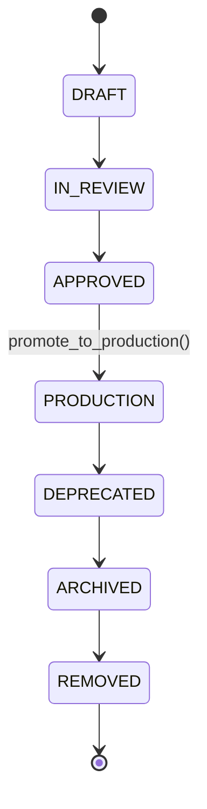

# 10 — Market Registry Schema

> Part of the standalone `docs/master-spec/` set — see the notice at the top of
> [`01-system-architecture.md`](01-system-architecture.md). This document specifies the catalog of
> every predictable outcome the platform offers, and which features each one depends on.

## 1. Tables

```sql
CREATE SCHEMA IF NOT EXISTS markets;

CREATE TABLE markets.market_definitions (
    id                      uuid PRIMARY KEY,
    market_key               text NOT NULL UNIQUE,    -- e.g. 'football.match_winner'
    sport_code                text NOT NULL,
    name                       text NOT NULL,
    category                    text NOT NULL,           -- 'winner' | 'totals' | 'handicap' | 'props' | ...
    market_kind                  text NOT NULL,           -- 'BINARY' | 'HOME_DRAW_AWAY' | 'TOTAL' | 'CORRECT_SCORE' | ...
    target_type                   text NOT NULL,           -- 'CLASSIFICATION' | 'REGRESSION'
    outcome_type                   text NOT NULL,
    allowed_values                  text[] NOT NULL DEFAULT '{}',
    resolver_key                     text,                    -- how a finished fixture resolves this market's real outcome
    description                       text NOT NULL,
    min_historical_window_days         integer NOT NULL DEFAULT 180,
    required_data_quality               text NOT NULL DEFAULT 'standard',
    explainability_required              boolean NOT NULL DEFAULT true,
    confidence_threshold                  numeric NOT NULL DEFAULT 0.55,
    status                                 text NOT NULL DEFAULT 'draft',  -- § 2 lifecycle
    owner                                   text NOT NULL,
    version                                  integer NOT NULL DEFAULT 1,
    created_at                                timestamptz NOT NULL DEFAULT now(),
    updated_at                                 timestamptz NOT NULL DEFAULT now()
);
CREATE INDEX ix_market_definitions_sport_status
    ON markets.market_definitions (sport_code, status);

-- The market ↔ feature edge: which features a market's predictor actually consumes.
CREATE TABLE markets.feature_market_mappings (
    id                       uuid PRIMARY KEY,
    market_id                 uuid NOT NULL REFERENCES markets.market_definitions(id),
    feature_key                text NOT NULL REFERENCES features.feature_definitions(feature_key),
    is_required                  boolean NOT NULL DEFAULT true,
    importance                     numeric,          -- populated post-training from feature_importance
    confidence_contribution         numeric,          -- how much this feature's quality affects Confidence Engine output
    weight                            numeric,          -- for baseline (non-ML) predictors' formula weighting
    UNIQUE (market_id, feature_key)
);
CREATE INDEX ix_feature_market_mappings_market_id
    ON markets.feature_market_mappings (market_id);
```

## 2. Lifecycle



| Status | Meaning |
|---|---|
| `DRAFT` | Registered, not yet reviewed. No predictions served. |
| `IN_REVIEW` | Under review for correctness of resolver logic, outcome definitions, feature mapping. |
| `APPROVED` | Reviewed and correct, but not yet live — typically waiting on a trained/promoted model. |
| `PRODUCTION` | Actively serving predictions. `promote_to_production()` **refuses** unless at least one row in `feature_market_mappings` has `is_required = true` — a market cannot go live with no defined feature dependency, which would mean nothing was actually reviewed. |
| `DEPRECATED` | No longer accepting new predictions; existing prediction history retained. |
| `ARCHIVED` | Fully retired from active use, kept for historical/audit queries. |
| `REMOVED` | Hard end state. |

## 3. Resolution

`resolver_key` names the logic that turns a finished fixture's real result into this market's actual
outcome label — e.g. `football.match_winner` resolves to `HOME`/`DRAW`/`AWAY` from
`raw.results.home_score`/`away_score`; `football.btts` resolves to `YES`/`NO` from whether both
scores are non-zero. This is what produces the training labels in
[`12-training-pipeline.md`](12-training-pipeline.md) and the `(predicted, actual)` pairs calibration
fits against (§ [02-ml-architecture.md](02-ml-architecture.md) §8) — a market without a correct
resolver cannot be trained or calibrated correctly, so `resolver_key` is required before a market
can leave `DRAFT`.

## 4. What This Document Does Not Cover

Full per-sport market catalogs → [`16-sport-prediction-engines.md`](16-sport-prediction-engines.md).
Feature definitions themselves → [`09-feature-registry-schema.md`](09-feature-registry-schema.md).
Which model actually serves a `PRODUCTION` market → [`11-model-registry-schema.md`](11-model-registry-schema.md).
