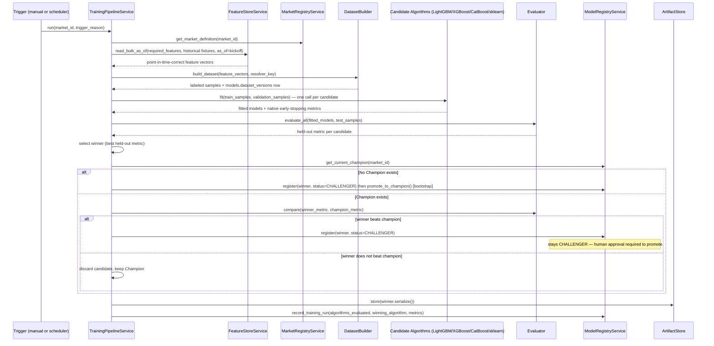

# 12 — Training Pipeline

> Part of the standalone `docs/master-spec/` set — see the notice at the top of
> [`01-system-architecture.md`](01-system-architecture.md). This document specifies exactly how a
> market goes from "Feature Store has enough data" to "a new Challenger is registered."

## 1. Sequence

## 2. Stages

| Stage | What happens |
|---|---|
| **Read Feature Store** | Bulk, point-in-time-correct reads via `FeatureStoreService.read_bulk_as_of()` (§ [08](08-feature-store-schema.md) §4) — never a live/online read, and `as_of` is always each historical fixture's real kickoff time, never "now." |
| **Build Dataset** | Assemble `(feature_vector, label)` samples into a `models.dataset_versions` row (§ [11](11-model-registry-schema.md) §1), recording the exact feature-version snapshot used. |
| **Generate Labels** | The market's `resolver_key` (§ [10](10-market-registry-schema.md) §3) turns each historical fixture's real result into this market's outcome label — never a proxy or estimated label. |
| **Train Model (`.fit()`)** | Every candidate algorithm in the roster (§ [02-ml-architecture.md](02-ml-architecture.md) §3) is fit against the same train split, with a shared validation split for algorithms that support native early stopping. |
| **Evaluate Model** | Held-out test-split metric per candidate: accuracy (+ log-loss/Brier score) for classification markets, MAE (+ RMSE) for regression markets. |
| **Compare Against Production** | The winning candidate's metric is compared against the current Champion's recorded metric for the same market — not re-evaluated on a different split, so the comparison is apples-to-apples. |
| **Deploy If Better** | "Better" is a documented, non-negotiable threshold (e.g. held-out accuracy improves by more than a noise-floor margin, not any nonzero improvement) — this stops a run from promoting on statistical noise. |
| **Archive Previous Version** | Handled by `ModelRegistryService.promote_to_champion()`'s retirement transaction (§ [11](11-model-registry-schema.md) §2) — the prior Champion's artifact is never deleted, only marked `RETIRED`. |
| **Record Metrics** | Every training run — successful, discarded, or failed — writes a `models.training_runs` row, so "we tried to retrain and it didn't beat the Champion" is a recorded fact, not silent. |

## 3. Split Strategy

Splits are **time-based, never random k-fold**: the test split is always the most recent slice of
the dataset window, validation the slice before that, train the oldest slice. A random split would
let a model see "future" matches during training relative to a validation match earlier in the same
window — the same leakage principle from
[`03-data-engineering-architecture.md`](03-data-engineering-architecture.md) §2 applies to how a
dataset is split, not just to how individual features are computed.

## 4. Minimum Sample Guard

`fit()` refuses below the minimum training sample threshold (30 samples — §
[02-ml-architecture.md](02-ml-architecture.md) §2) by raising `InsufficientTrainingDataError`. The
Training Pipeline treats this as an expected, handled outcome for a young market (the training run
is recorded as `status='failed'`, `trigger`-visible reason `insufficient_data`), not a crash — a
market with too little history simply keeps serving its statistical baseline
(§ [13-prediction-pipeline.md](13-prediction-pipeline.md) §2) until enough real results accumulate.

## 5. Hyperparameter Search

Optuna drives hyperparameter optimization for the gradient-boosting candidates (LightGBM, XGBoost,
CatBoost) — a bounded number of trials per candidate per training run, optimizing directly for the
same held-out metric used for the final comparison (§2 "Evaluate Model"), so a tuned model is never
selected on a different objective than the one it's judged against. HPO trial history is retained
per `training_runs` row for reproducibility, not just the winning hyperparameter set.

## 6. Independence from Prediction

The Training Pipeline never touches the Prediction Service's hot path. It reads the same Feature
Store the Prediction Service reads, but through the offline-only, bulk API — never the online cache
— and it writes only to the Model Registry, never directly to whatever a live request is currently
loading. A promotion becomes visible to Prediction only through the Model Registry's `status`
column, on the Prediction Service's own model-loading cadence (§
[13-prediction-pipeline.md](13-prediction-pipeline.md) §3).

## 7. What This Document Does Not Cover

What triggers a training run in the first place (fixture-finish, drift, staleness) →
[`14-automatic-retraining.md`](14-automatic-retraining.md). Serving path →
[`13-prediction-pipeline.md`](13-prediction-pipeline.md). HTTP trigger contract →
[`15-api-contracts.md`](15-api-contracts.md).
