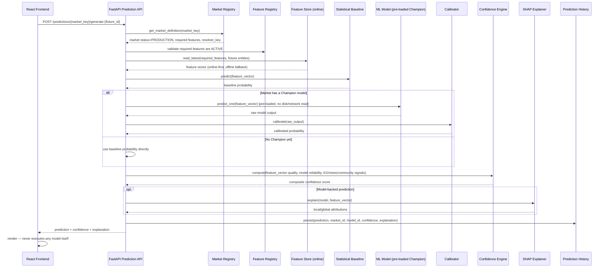

# 13 — Prediction Pipeline

> Part of the standalone `docs/master-spec/` set — see the notice at the top of
> [`01-system-architecture.md`](01-system-architecture.md). This document specifies exactly what
> happens between a user clicking "Generate Intelligence" and a prediction rendering on screen.

## 1. Sequence



## 2. Statistical Baseline Always Runs First

The baseline (§ [02-ml-architecture.md](02-ml-architecture.md) §1, §4) is computed for **every**
request, regardless of whether a Champion model exists — it is the guaranteed-available fallback,
and for markets with no Champion yet it *is* the served prediction, honestly labeled as
baseline-only rather than presented as equivalent to a model-backed prediction.

## 3. Models Are Loaded, Never Trained, On This Path

The Prediction Service keeps every market's current Champion artifact warm — loaded into process
memory (or a fast local cache with a short reload interval) — refreshed on a background schedule
that watches the Model Registry for promotion events. A prediction request:

- **Never** calls `.fit()` (§ [04-mlops-architecture.md](04-mlops-architecture.md) §2 — this is the
  hardest boundary in the system).
- **Never** blocks on artifact storage I/O on the hot path — the artifact was already loaded before
  the request arrived.
- **Never** trusts the frontend to run any part of this — React only ever renders a JSON response
  the backend produced; no model weights, no inference code, ship to the client.

## 4. Calibration Applies Only to Model Output

The baseline's own probability is not run through the calibrator — a closed-form statistical model's
output is already a direct probability by construction, and recalibrating it would double-correct.
Calibration (§ [02-ml-architecture.md](02-ml-architecture.md) §8) applies specifically to the ML
model's raw score, which gradient-boosted trees in particular are known to produce overconfident.

## 5. Prediction History Schema

```sql
CREATE SCHEMA IF NOT EXISTS predictions;

CREATE TABLE predictions.predictions (
    id                  uuid PRIMARY KEY,
    market_id             uuid NOT NULL REFERENCES markets.market_definitions(id),
    model_id                uuid REFERENCES models.model_definitions(id),  -- null if baseline-only
    fixture_id                uuid NOT NULL REFERENCES raw.fixtures(id),
    predicted_probability       double precision NOT NULL,
    predicted_value                double precision,          -- for regression-type markets
    confidence_score                  numeric NOT NULL,
    confidence_breakdown                 jsonb NOT NULL,       -- per-factor scores, § 02-ml-architecture.md §7
    explanation                            jsonb,                -- SHAP bundle or baseline formula breakdown
    feature_vector_snapshot                  jsonb NOT NULL,       -- exact inputs used, for audit/replay
    generated_at                               timestamptz NOT NULL DEFAULT now()
);
CREATE INDEX ix_predictions_market_fixture ON predictions.predictions (market_id, fixture_id);
CREATE INDEX ix_predictions_model_id ON predictions.predictions (model_id);

-- Populated once a fixture finishes and the market's resolver produces a real outcome —
-- this is what both calibration fitting (§ 02-ml-architecture.md §8) and drift detection
-- (§ 14-automatic-retraining.md) read from.
CREATE TABLE predictions.prediction_outcomes (
    prediction_id        uuid PRIMARY KEY REFERENCES predictions.predictions(id),
    actual_outcome          text NOT NULL,
    resolved_at                timestamptz NOT NULL DEFAULT now()
);
```

## 6. Latency Budget

Every stage in §1 after the Feature Store read is in-process (loaded model, in-memory calibrator,
SHAP TreeExplainer against an already-fitted estimator) — the only network calls on the hot path are
the online Feature Store read and the Prediction History write, both of which target the
non-functional latency targets in [`01-system-architecture.md`](01-system-architecture.md) §9
(p95 < 300ms cached, p95 < 2s cold).

## 7. What This Document Does Not Cover

Training/promotion (how a Champion gets there) → [`12-training-pipeline.md`](12-training-pipeline.md).
Fixture-finish-triggered retraining → [`14-automatic-retraining.md`](14-automatic-retraining.md).
The exact HTTP request/response shape → [`15-api-contracts.md`](15-api-contracts.md).
