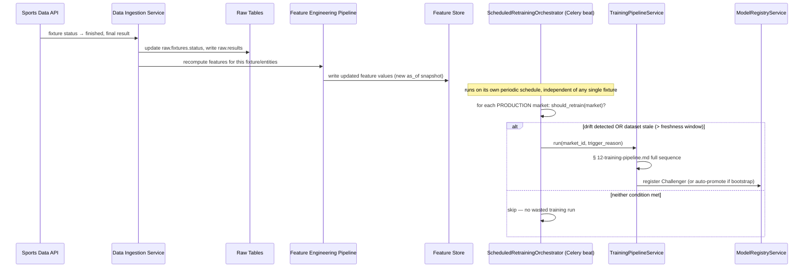

# 14 — Automatic Retraining

> Part of the standalone `docs/master-spec/` set — see the notice at the top of
> [`01-system-architecture.md`](01-system-architecture.md). This document specifies what happens
> when a fixture finishes — the trigger path that keeps every market's data and models current
> without a human kicking off each run by hand.

## 1. Trigger Sequence



## 2. Stage-by-Stage

| Stage | Detail |
|---|---|
| Retrieve official results | The Data Ingestion Service's normal per-fixture sync path — no special-cased "retraining" ingestion, the same adapters that populate `raw.fixtures`/`raw.results` for any other reason. |
| Update raw tables | Standard append/update per [`07-raw-data-schema.md`](07-raw-data-schema.md) §7 invariants. |
| Recompute engineered features | The same Feature Engineering Pipeline stages as [`03-data-engineering-architecture.md`](03-data-engineering-architecture.md) §2, scoped to the entities affected by this fixture (both teams' rolling stats, any player-level stats, head-to-head). |
| Update Feature Store | New `feature_values` rows, new `as_of` — never overwriting the pre-fixture snapshot (§ [08](08-feature-store-schema.md) §2), so the *previous* feature state is still queryable for any model that was trained against it. |
| Generate labels | Not a separate step here — labels are generated fresh at training time from `resolver_key` (§ [12](12-training-pipeline.md) §2), so a fixture doesn't need a "label" written anywhere until a training run actually consumes it. |
| Retrain candidate model | Delegates entirely to [`12-training-pipeline.md`](12-training-pipeline.md) — this document owns *when* training happens, not *how*. |
| Evaluate | Same held-out comparison as §12 §2. |
| Deploy only if performance improves | Same "beats the current Champion by more than the noise-floor margin" rule as §12 §2 — a finished fixture updating the data does not itself deploy anything; only a training run that produces a genuinely better model does. |
| Archive previous model | Handled by the promotion transaction (§ [11](11-model-registry-schema.md) §2). |
| Record metrics | Every triggered run, successful or not, is a `models.training_runs` row (§ [12](12-training-pipeline.md) §2). |

## 3. What Triggers a Retraining Run

A market is retrained when **either** condition is true — evaluated per-market on the orchestrator's
own periodic sweep, not per-fixture (so 10 fixtures finishing in the same hour for the same market
don't queue 10 redundant training runs):

```python
def should_retrain(market: MarketDefinition, champion: ModelDefinition | None) -> bool:
    if champion is None:
        return has_minimum_training_data(market)   # bootstrap — no champion to compare against

    drift = recent_live_accuracy(champion) < champion.metrics["held_out_accuracy"] - DRIFT_THRESHOLD
    stale = (now() - champion.trained_at) > market.retraining_freshness_window

    return drift or stale
```

- **Drift detected**: the Champion's *live* prediction accuracy (measured from
  `predictions.prediction_outcomes`, § [13](13-prediction-pipeline.md) §5) has degraded past a
  documented margin relative to what it scored at training time — a sign the world has moved (a
  competition's playing style shifted, a season boundary passed) faster than the model has.
- **Dataset staleness**: the Champion's `trained_at` is older than the market's configured
  freshness window, regardless of measured drift — so a market never silently coasts on a widening
  blind spot just because nothing has *obviously* broken yet.

## 4. Rolling-Window, Never Online Learning

Every retraining run builds a **fresh** dataset from the current trailing window
(`min_historical_window_days`, § [10](10-market-registry-schema.md) §1) and fits a new model from
scratch — it never incrementally updates the currently-serving model's weights in place. This is a
deliberate constraint, not a missing optimization:

- **Reproducibility**: a Champion's `dataset_version_id` (§ [11](11-model-registry-schema.md) §1)
  is always a complete, fixed snapshot — you can rebuild exactly what it saw. An online-updated
  model has no such fixed point.
- **Safe rollback**: rolling back to a `RETIRED` model (§ [11](11-model-registry-schema.md) §2)
  means rolling back to a fully-formed, independently-evaluated artifact — not trying to undo a
  sequence of incremental gradient updates.
- **Evaluation integrity**: comparing a candidate against the Champion (§ [12](12-training-pipeline.md)
  §2) only means something if both were evaluated the same way, on comparable held-out splits — an
  online-updated model's "current state" is a moving target that can't be evaluated the same way
  twice.

## 5. What This Document Does Not Cover

The training run mechanics themselves → [`12-training-pipeline.md`](12-training-pipeline.md).
Ingestion adapter details per sport → [`07-raw-data-schema.md`](07-raw-data-schema.md).
Celery/beat scheduling infrastructure → [`17-deployment-strategy.md`](17-deployment-strategy.md).
