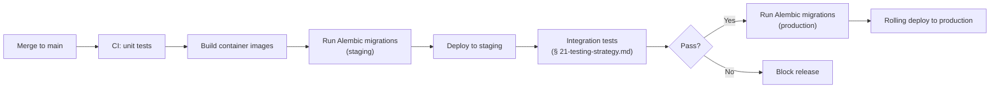

# 17 — Deployment Strategy

> Part of the standalone `docs/master-spec/` set — see the notice at the top of
> [`01-system-architecture.md`](01-system-architecture.md).

## 1. Deployment Units

Three independently deployable, independently scalable processes, matching
[`05-fastapi-folder-structure.md`](05-fastapi-folder-structure.md) §2's `apps/` split — each its
own container image, built and released on its own schedule:

| Unit | Contains | Scales on |
|---|---|---|
| `apps/api` | FastAPI HTTP server — Prediction API, Training API, all registry endpoints | Request volume / p95 latency |
| `apps/worker` | Celery worker — ingestion tasks, Feature Engineering Pipeline runs, training runs | Queue depth |
| `apps/scheduler` | Celery beat — periodic ingestion sync, `ScheduledRetrainingOrchestrator` sweep | Fixed (single leader; not horizontally scaled) |

## 2. Two Independent Deployment Concepts

This platform has two different things that can be "deployed," and conflating them is a common
source of incidents:

- **Application deployment** — a new container image for `apps/api`/`apps/worker`/`apps/scheduler`,
  released through the normal CI/CD pipeline (§3). Changes code.
- **Model deployment** — a Challenger promoted to Champion (§ [11-model-registry-schema.md](11-model-registry-schema.md) §2).
  Changes which trained artifact the already-running Prediction Service loads. **Never requires a
  code release** — the Prediction Service picks up a new Champion on its own background refresh
  cadence (§ [13-prediction-pipeline.md](13-prediction-pipeline.md) §3), typically within minutes,
  with zero downtime and zero new container image.

Rollback follows the same split: an application regression is rolled back by reverting to the prior
container image; a model regression is rolled back via `POST /models/{id}/rollback`
(§ [15-api-contracts.md](15-api-contracts.md) §3) — the two rollback paths are operated
independently and a bad model promotion never requires (or waits on) a code deploy to fix.

## 3. Release Pipeline

- Migrations always run **before** the new application code that depends on them, and are additive
  wherever possible (new nullable columns, new tables) so a brief window where old and new code run
  against the same schema never breaks either.
- `apps/api` deploys as a rolling update behind health checks (`/healthz` — DB connectivity, Redis
  connectivity, at least one Champion model loaded per active market) — a pod that fails its health
  check is never routed traffic.
- `apps/worker` deploys with `task_acks_late=True` already assumed (a task in flight during a
  deploy is redelivered, not lost).
- `apps/scheduler` deploys as a single-leader replacement (old scheduler instance drains, new one
  takes over) — never two active beat schedulers running simultaneously, which would double-fire
  periodic tasks.

## 4. Environments

| Environment | Purpose | Data |
|---|---|---|
| Local / dev | Fast iteration | Local Postgres (or SQLite for unit tests), local Redis |
| Staging | Pre-production validation, integration test target | Postgres, seeded with anonymized/synthetic historical fixtures |
| Production | Live traffic | Postgres (managed, with read replicas — § [19-scaling-strategy.md](19-scaling-strategy.md)), Redis (managed) |

## 5. What This Document Does Not Cover

Infrastructure scaling policy → [`19-scaling-strategy.md`](19-scaling-strategy.md). Health/alerting
signals → [`18-monitoring-strategy.md`](18-monitoring-strategy.md). Secrets and access control →
[`20-security-strategy.md`](20-security-strategy.md).
