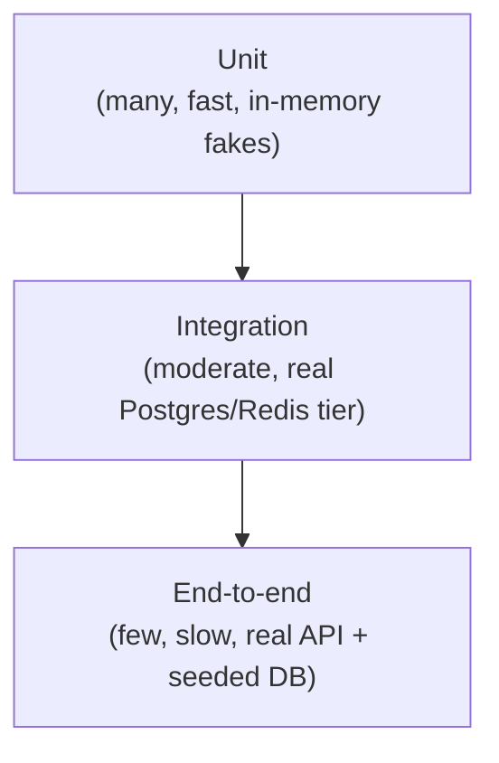

# 21 — Testing Strategy

> Part of the standalone `docs/master-spec/` set — see the notice at the top of
> [`01-system-architecture.md`](01-system-architecture.md). This is the last document in the set —
> see [`index.md`](index.md) for the full table of contents.

## 1. Test Pyramid

Mirrors the convention in [`05-fastapi-folder-structure.md`](05-fastapi-folder-structure.md) §4:
`tests/unit/` (mirrors `apps/`/`modules/` 1:1, per-module `conftest.py` providing an in-memory async
database and hand-rolled repository fakes — no network dependency, runs on every commit) and
`tests/integration/` (real Postgres/Redis tier, exercises RLS, real migrations, real cross-service
behavior — runs pre-release, not required on every commit, since it needs live infrastructure).

## 2. Unit Test Coverage by Layer

| Layer | What's tested | How |
|---|---|---|
| `domain/` | Pure business rules — entity invariants, state-transition validity (e.g. `MarketDefinition.promote_to_production()` refusing with zero required feature mappings, § [10](10-market-registry-schema.md) §2) | Plain unit tests, no I/O at all |
| `application/` | Service orchestration logic | In-memory repository fakes standing in for `ports/` |
| `infrastructure/persistence/` | Repository implementations against real SQL | In-memory async SQLite/Postgres engine, real migrations applied |
| `infrastructure/ml/` | Each `PredictionModel` adapter (LightGBM/XGBoost/CatBoost/sklearn) | A **shared contract test suite**, run against every adapter: fit on synthetic data → `predict_one` returns a valid distribution → `serialize()`/`deserialize()` round-trips to an identical prediction → `feature_importance()` returns a value per input feature. One adapter cannot silently violate the `PredictionModel` protocol (§ [02-ml-architecture.md](02-ml-architecture.md) §2) without the shared suite catching it. |
| `apps/api/routers/` | Request/response contract, auth/role enforcement | `test_api_<module>.py`, FastAPI `TestClient` against a fully wired (but in-memory) app |

## 3. ML-Specific Test Classes

These exist because a passing unit test suite does not, by itself, prove an ML pipeline is
*correct* in the way it proves a CRUD endpoint is correct — the pipeline's failure modes are
different (silent leakage, silent mislabeling) and need purpose-built tests:

- **Leakage assertions** (§ [03-data-engineering-architecture.md](03-data-engineering-architecture.md)
  §4): every feature calculator is tested with a fixture set that includes data timestamped *after*
  the `as_of` cutoff, asserting the calculator's output is identical whether or not that future data
  is present — proving it was never read.
- **Resolver correctness**: a fixed, hand-verified "golden" set of finished fixtures with known
  correct outcomes for every market, asserting `resolver_key` logic (§ [10](10-market-registry-schema.md)
  §3) produces the exact expected label for each — including edge cases (a 0-0 draw for BTTS, a
  push/exact-line result for totals markets).
- **Calculator determinism**: the same raw input, computed twice, produces the same feature value —
  guards against accidental non-determinism (e.g. an unordered dict iteration affecting a
  rolling-average calculation) that would make a model's training-vs-serving feature values
  silently diverge.
- **Calibration monotonicity**: a fitted calibrator's output is non-decreasing in its input across
  the probability range — a calibration curve that isn't monotonic is a bug in the fitting process,
  not a legitimate correction.
- **Model registry invariant tests**: concurrent-promotion race test asserting the database-level
  partial unique indexes (§ [11-model-registry-schema.md](11-model-registry-schema.md) §1) actually
  prevent two simultaneous Champions under real concurrent writes, not just under sequential test
  execution.

## 4. Integration Tier

Runs against real Postgres and Redis (containerized in CI, not mocked):

- **RLS enforcement**: a query issued as one tenant/role genuinely cannot read another's rows, even
  when the application-layer check is bypassed in the test to isolate the database-layer guarantee.
- **End-to-end migration replay**: the full Alembic history applies cleanly to an empty database,
  in order, with no manual intervention — every release depends on this holding.
- **Cross-service flow**: a seeded set of historical fixtures → run the real Feature Engineering
  Pipeline → real Training Pipeline → real promotion → real Prediction Service call — asserting the
  full chain in [`13-prediction-pipeline.md`](13-prediction-pipeline.md) produces a sane,
  well-formed response, not each stage tested only in isolation.

## 5. Test Data

Unit and integration tests run against synthetic and/or anonymized historical fixture data — never
against production data directly. Synthetic fixture generators are deterministic (seeded), so a
flaky ML test is never explained away as "random test data," which would hide a real bug.

## 6. CI Gates

- Full unit suite: required to pass before merge, on every commit — fast enough (in-memory, no real
  infra) to run on every push.
- Integration suite: required to pass before a release is promoted from staging to production
  (§ [17-deployment-strategy.md](17-deployment-strategy.md) §3), not required on every individual
  commit, since it depends on live Postgres/Redis and is correspondingly slower.
- A merge that only touches `docs/master-spec/` (documentation, no application code) is exempt from
  both gates — this document set is itself an example of that case.
